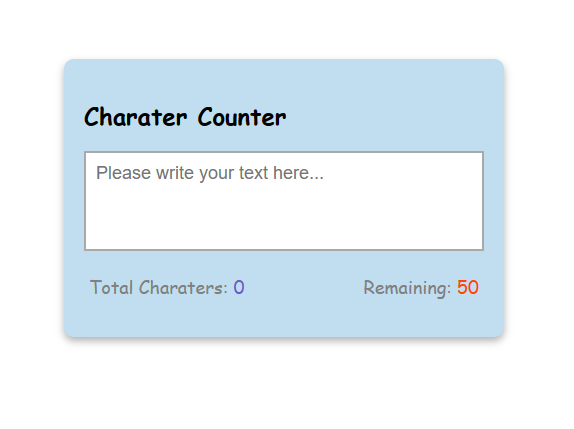

# Character-Counter

 ## Description
This simple web application is built using JavaScript and is designed to count the number of characters in a given text input.

## Features
- Counts the number of characters in a text input in real-time.
- Displays the character count prominently to the user.
- Supports both single-line and multi-line text inputs.
- Provides a clear and user-friendly interface.

## Usage
1. Open the Character Counter App in your web browser by opening the index.html file.

2. You will see a text area input box.

3. Start typing or paste text into the input box, and the app will automatically update the character count in real-time.

4. The character count will be displayed prominently on the screen below the input box.

5. You can use this app to count characters in both single-line and multi-line text.

6. To reset the character count, simply clear the text input box.